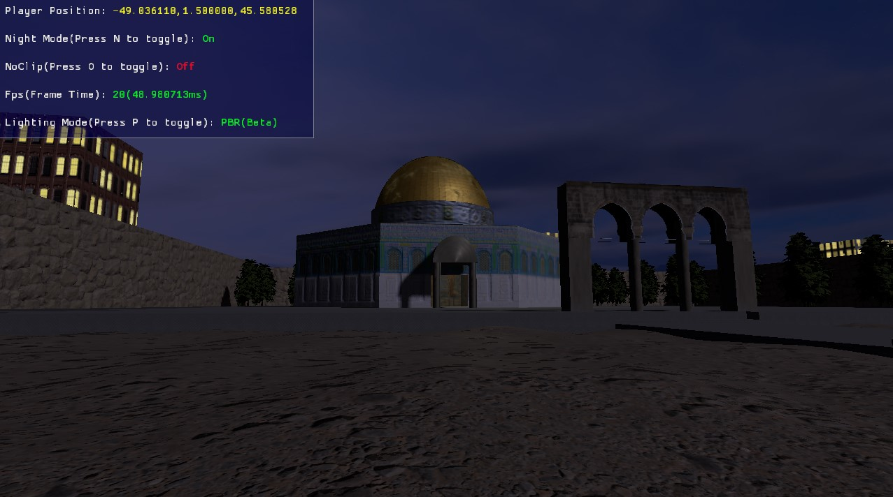

## AL-Aqsa Mosque

3D Al-Aqsa Mosque, made with modern OpenGL (4.6)

## Building From Source

First, you should have "Desktop Development with C++" workload installed (via [visual studio installer](https://learn.microsoft.com/en-us/cpp/build/vscpp-step-0-installation?view=msvc-170#step-4---choose-workloads)).

Next, make sure powershell is recognized by cmd,
- Open cmd
- Run `pwsh --version`

Finally, building the project is straight foreword,
- Clone this repo, 
- Open .sln file with visual studio 2022
- Run (note that it is better to run in release mode).

This project is really heavy, and is in the workings for optimization